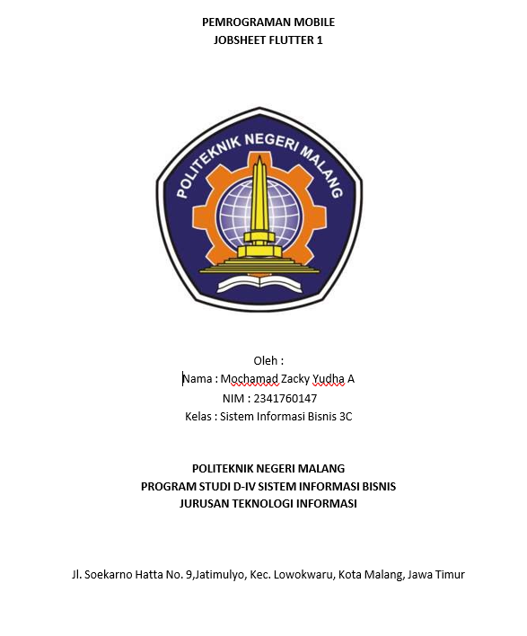

# PRAKTIKUM 1 : Membuat Project Flutter Baru 
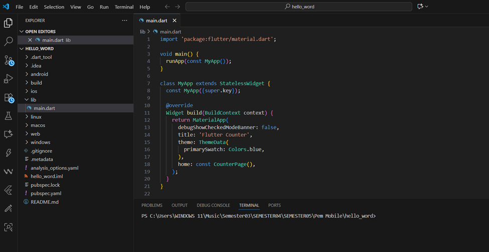

# PRAKTIKUM 2 : Perangkat Android Emulator 

# PRAKTIKUM 3 : Membuat repository baru 

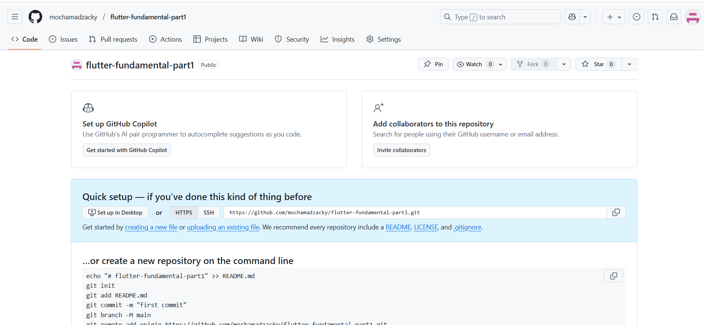

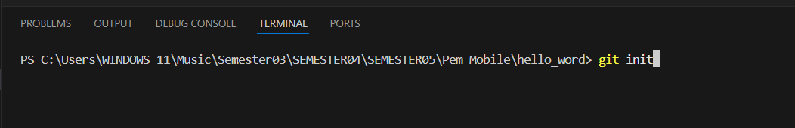
kembali ke vscode lalu buka terminal (git init)
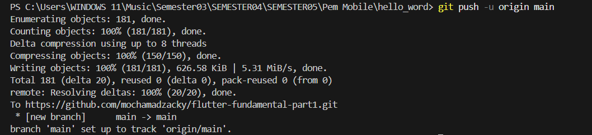
mengepush projek pertama saya di github
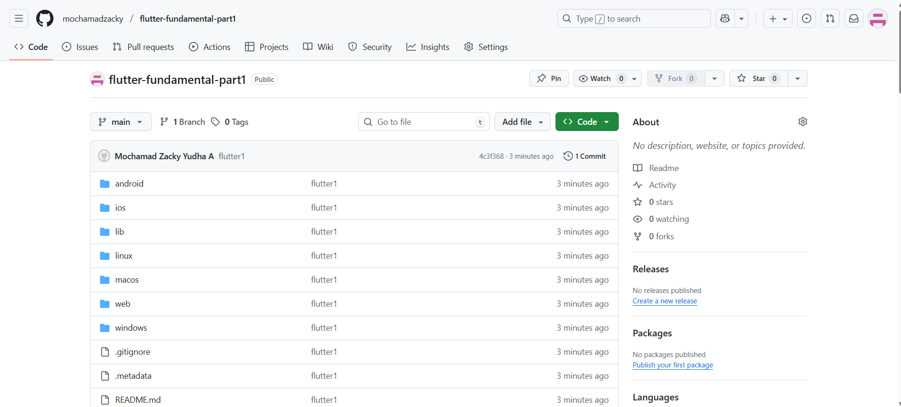
mengerun aplikasi flutter pertama saya 
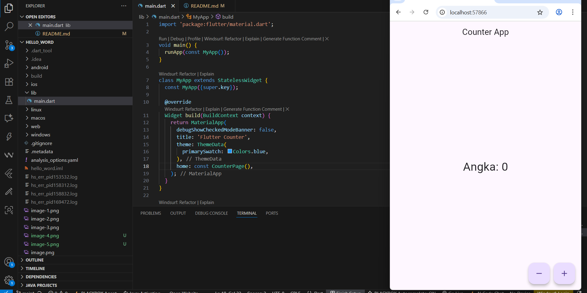 

# PRAKTIKUM 4 : Menerapkan Widget Dasar
Membuat folder baru basic_widgets dan membuat file didalamnya text_widget.dart
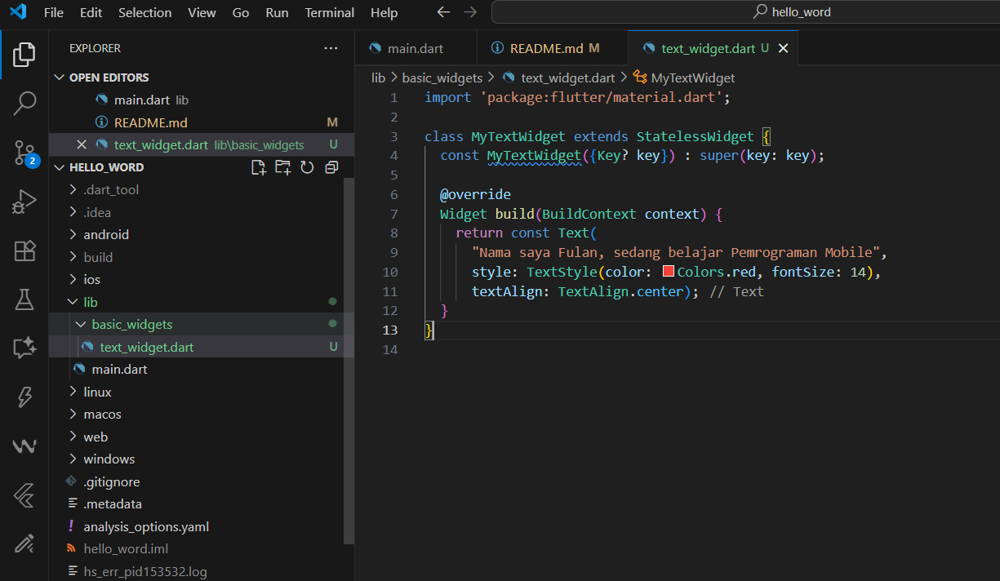

Kemudian melakukan import widget ke main.dart 
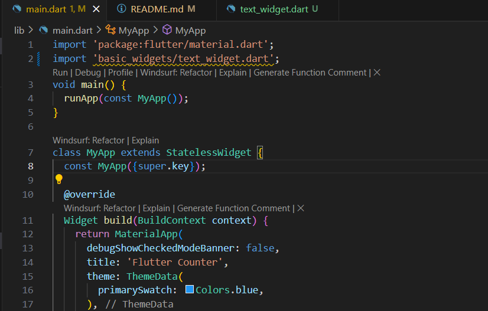
Berikut screenshot hasil aplikasi saya 
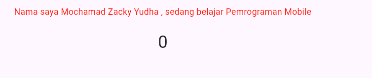
Membuat file image_widget.dart pada folder basic widget 
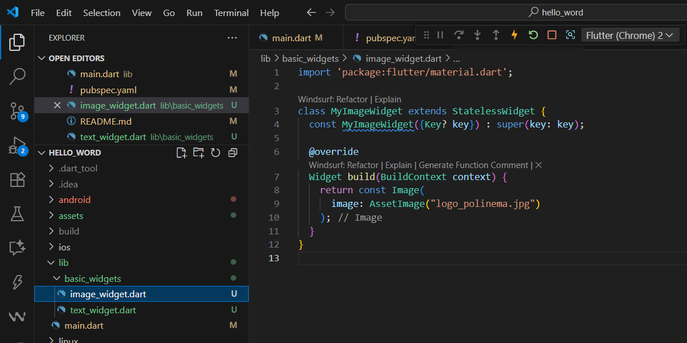
Kemudian membuat folder baru assets untuk menyimpan file gambar yang akan ditampilkan 
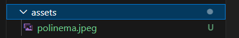
Lanjut melakukan penyesuaian asset pada file pubspec.yaml
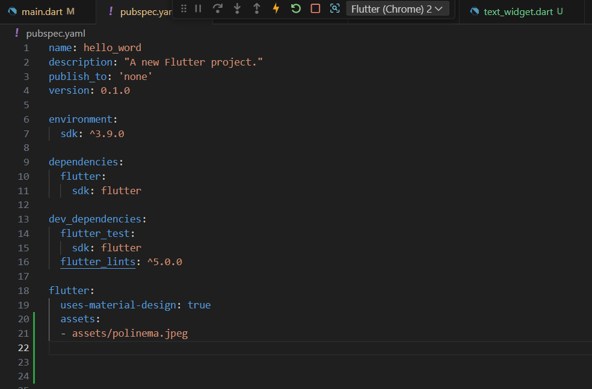
Berhasil menampilkan gambar pada aplikasi saya 
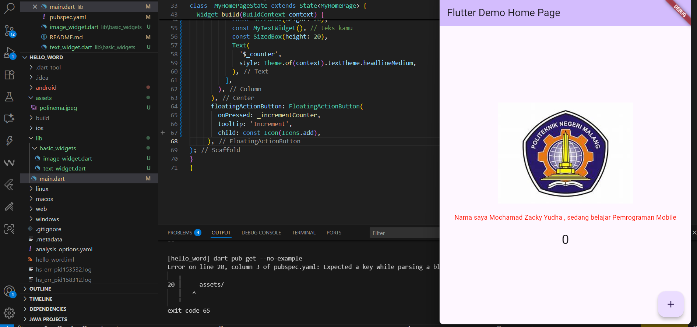

# PRAKTIKUM 5 : Menerapkan Widget Material Design dan iOS Cupertino
Membuat file loading_cupertino.dart pada folder basic widget 
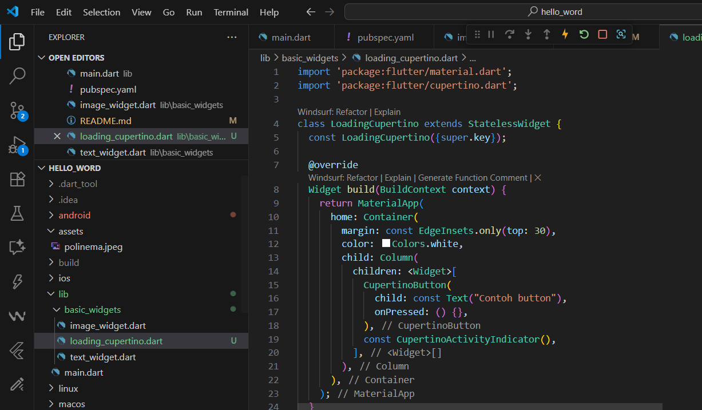
Berikut contoh button loading pada tampilan aplikasi saya 
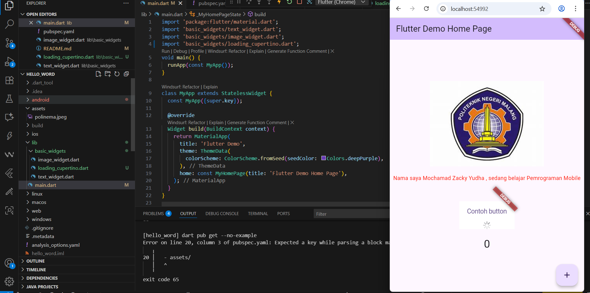
Membuat file fab_widget.dart pada folder basic widget
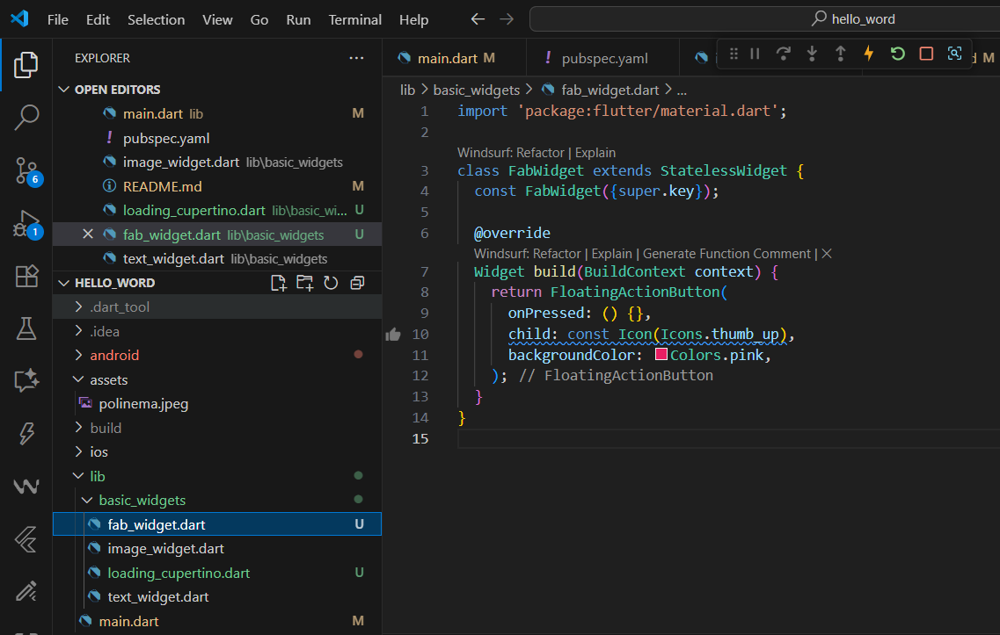
kemudian menampilkannya pada aplikasi saya 
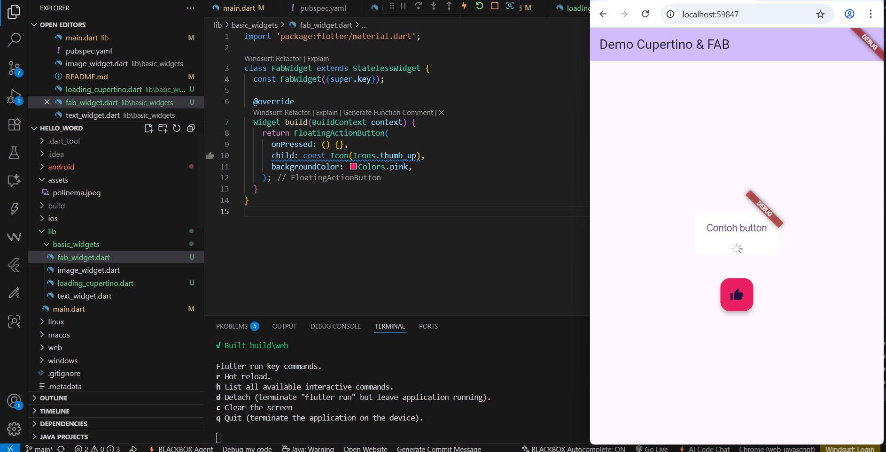
Scaffold Widget 
mengubah kode main.dart dan menampilkan nya seperti berikut 
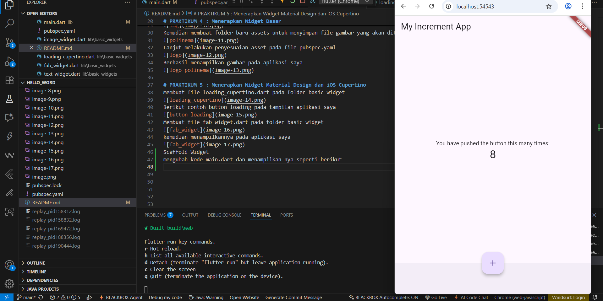
Dialog widget 
Dialog widget pada flutter memiliki dua jenis dialog yaitu AlertDialog dan SimpleDialog.
Mengubah isi main.dart dan menampilkannya seperti berikut
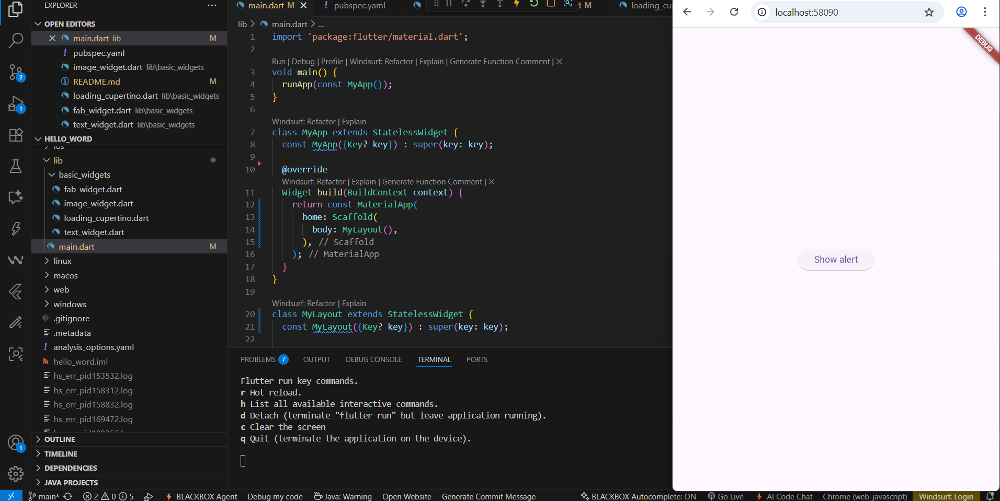
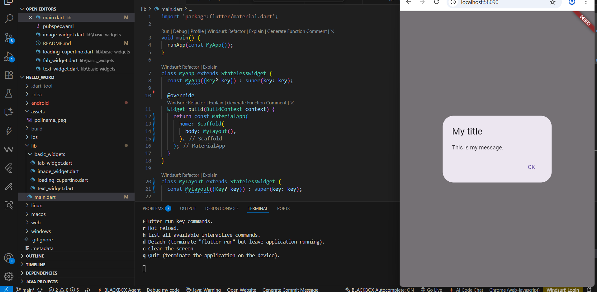
Date and Time Pickers
Date and Time Pickers termasuk pada kategori input dan selection widget, berikut adalah contoh penggunaan Date and Time Pickers.
mengubah kode main.dart dan menampilkannya pada aplikasi saya 
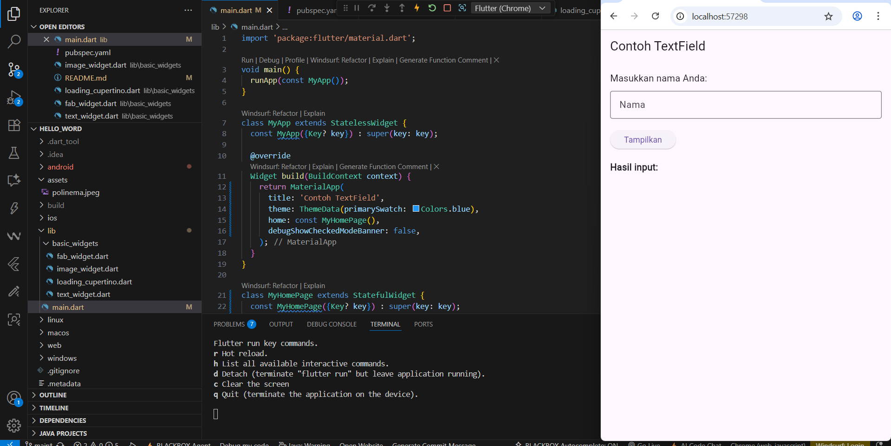
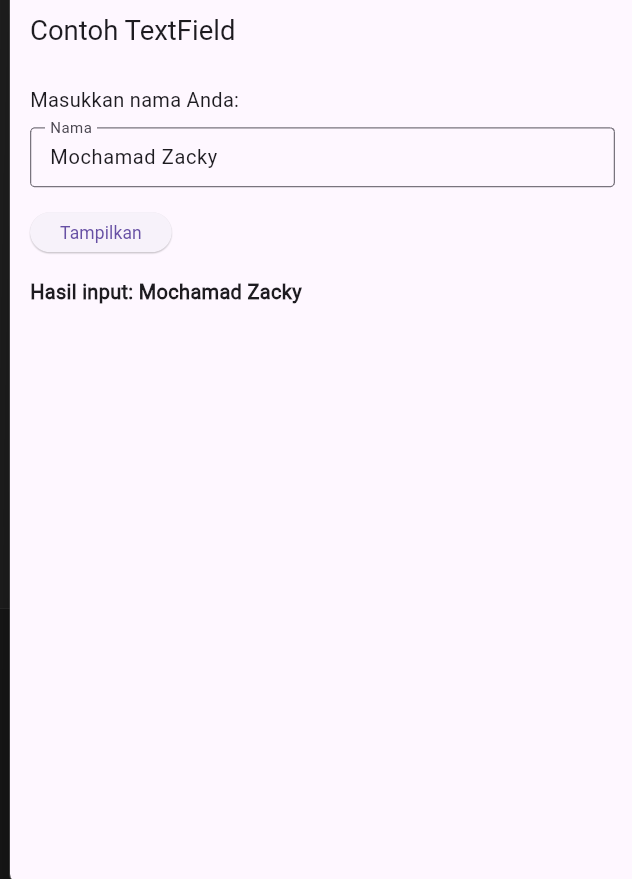

